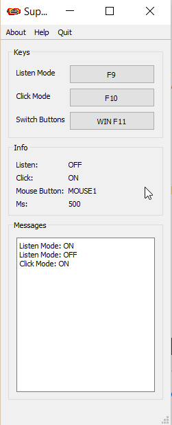
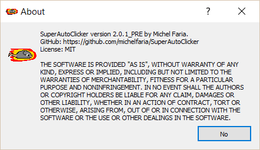

# Table of Contents

- [Table of Contents](#table-of-contents)
- [SuperAutoClicker (English)](#superautoclicker-english)
  - [Screenshots](#screenshots)
  - [Supported Operating Systems](#supported-operating-systems)
  - [Recommendations](#recommendations)
- [Usage](#usage)
  - [In a nutshell](#in-a-nutshell)
  - [Example](#example)
- [Customizing Keys](#customizing-keys)
- [Download](#download)
- [Building](#building)
  - [Windows](#windows)
- [Troubleshooting](#troubleshooting)
  - [The autoclicker doesn't work on [GAME].](#the-autoclicker-doesnt-work-on-game)
- [License](#license)

# SuperAutoClicker (English)

What makes SuperAutoClicker so different from the other autoclickers out there? The answer to that question is: you can control the autoclicker from within your game. All you have to do is configure your keybindings, , and bam! You can set the interval, toggle the clicker on and off and switch between both mouse buttons, **all without alt-tabbing out of the game**. 

## Screenshots

(slightly outdated)

## Supported Operating Systems

Only Windows is supported as of now. Linux support is a work in progress.

## Recommendations

It is recommended that you have a keyboard with a dedicated numpad.

# Usage

You control SuperAutoClicker by using the keyboard. **The window does not have to be active for it to listen to your inputs.**

To begin using the auto clicker, press the `Listen Mode` button. In Listen Mode, you can use the number keys to specify the interval (in milliseconds) between clicks. Do note that there is a limit of 7 digits in your input.

When you're done entering your desired interval, you can press the Listen Mode button again to save it or you can simply press the `Click Mode` button to toggle Click Mode. When it is turned on, the program will begin clicking at such interval.

You can press the `Toggle Mouse Button` key to switch between the left and right mouse buttons. If you want to stop the auto clicker, press the Toggle Mouse Button again.

You can also change the interval on the go, while the auto clicker is clicking. Simply press turn on Listen Mode, type your millisecond interval and then turn off Listen Mode.

## In a nutshell

|                           | Description                                                                                                                                      |
| ------------------------- | ------------------------------------------------------------------------------------------------------------------------------------------------ |
| `Toggle Mouse button`     | Switches between left and right mouse buttons.                                                                                                   |
| `Listen Mode`             | State in which the program listens for your numeric inputs. Your numeric inputs will be stored as millisecond intervals for the autoclicker.     |
| `Click Mode`              | State in which the program repeatedly clicks with either the left or right mouse button repeatedly, depending on your Toggle Mouse Button state. |
| `Number Row or NUMPAD0-9` | Inputs milliseconds while in Listen Mode.                                                                                                        |
| `Slow Click Mode`         | **(Advanced)** Certain games will only work with this option enabled.                                                                            |

## Example

- Example 1: Setting the autoclicker to click at a 100 ms interval.
    - Open SuperAutoClicker.
    - Press the `Listen Mode` button.
    - Type `1 0 0` with the number row or your numpad.
    - Press the `Listen Mode` button to save your input.
        - Press the `Click Mode` button to start clicking.
        - Press the `Click Mode` button again to turn the autoclicker off.
    - **OR:**  Press the `Click Mode` button to immediately start clicking.

- Example 2: Changing the autoclicker on the fly from 200 ms to 10 ms.
   - Open SuperAutoClicker.
   - Press the `Listen Mode` button.
   - Type `2 0 0`.
   - Press `Click Mode` button to start clicking.
   - Press the `Listen Mode` button again.
   - Type `1 0`.
   - Press the `Listen Mode` button again.
   - The auto clicker should instantly switch to the new speed.

# Customizing Keys

To change your keybindings, simply click the button of the action you want to change. Then enter the key combination on your keyboard.

# Download

[All Releases](https://github.com/michelfaria/SuperAutoClicker/releases)

# Building

## Windows

**Requirements:** **Qt Creator 4.9.0, QMake 3.1, Qt (5.12.3), (MSVC 2017)**

- **Command-line:**
    - Release

            qmake src.pro -spec win32-msvc "CONFIG+=qtquickcompiler"
            jom in Release
    
    - Debug

            qmake src.pro -spec win32-msvc "CONFIG+=debug" "CONFIG+=qml_debug"
            jom in Debug

- **Qt Creator**
    - Open `src/src.pro` and build the project.

# Troubleshooting

## The autoclicker doesn't work on [GAME].

The current version comes with `Slow Click Mode` which aims to fix this problem.
Simply toggle it on and try again.

# License

Project is licensed under MIT License. See [LICENSE.md](./LICENSE.md) for details.
